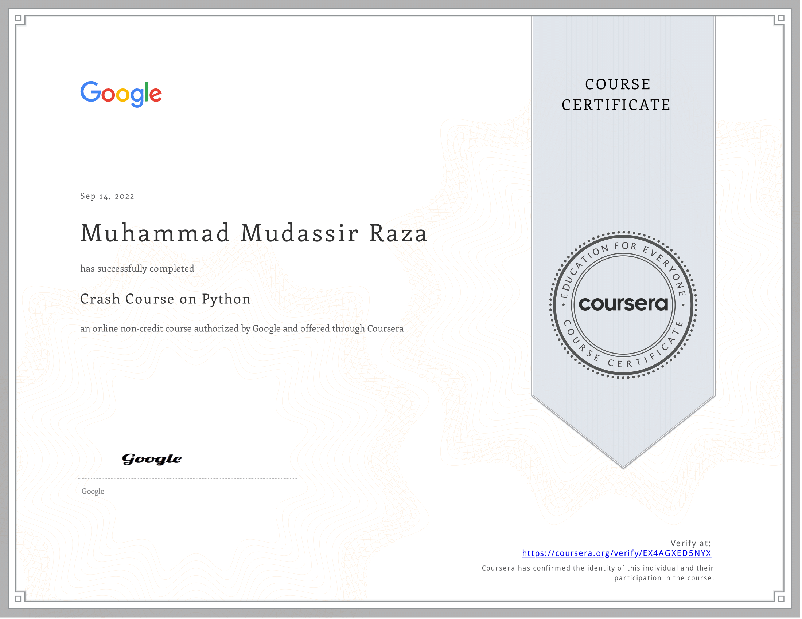

<!-- ctrl+shiht+p or ctrl+k+v for preview side-->
# Contents

[1- Headings](#1-headings)\
[2- Block Of Words](#2-block-of-words)\
[3- Line Breaks](#3-line-breaks)\
[4- Combine To Things](#4-combine-to-things)\
[5- Face Of Texts](#5-face-of-texts)\
[6- Bullets Points List](#6--bullets-pointslist)\
[7- Line Breaks or Page Breaks](#7--line-breaks-or-page-breaks)\
[8- Links And Hyperlinks](#8--links-and-hyperlinks)\
[9- Images And Figures With Links](#9--images-and-figures-with-links)\
[10- Code or Code Block](#10--code-or-code-block)\
[11- Adding Tables](#11--adding-tables)\
[12- Install Extensions](#13--install-extensions)


# 1-Headings
How to give headings in markdown files?


# Heading 1
## Heading 2
### Heading 3
### Heading 4

# 2-Block of words

This is normal text in markdown
>This is special text in markdown

>This is special text in markdown

>This is special text in markdown
>
>This is special text in markdown


# 3-Line Breaks

This is Mudassir.

He doing BSCS

or

This is Mudassir.\
He doing BSCS

# 4-Combine to things

blocks of words

## Heading2

# 5-Face of Texts
**Bold**\
*Italic*\
***Bold and Italic***\

or you can used these symbols
_(Underscores)

__Bold__

__Italic__

___Bold and Italic___


# 6- Bullets Points/List
- Day-1
- Day-2
- Day-3
- Day-4
- Day-5
   - Day-5a 
      - sub list (Anthing)
   - Day-5b
   - Day-5c
- Day-6
- Day-7

>__Using * or +__

* One
+ One

>Numberings of List

1. Day1
2. Day2
3. Day3
1. Day4
1. Day5
    1. Day-5a
    1. Day-5b
    1. Day-5c

# 7- Line breaks or page breaks

This is page 1.

---
___

***

# 8- Links and HyperLinks
<https://www.youtube.com/watch?v=qJqAXjz-Rh4&list=PL9XvIvvVL50HVsu-Ao8NBr0UJSO8O6lBI&index=21>

[The playlist of python is here](https://www.youtube.com/watch?v=qJqAXjz-Rh4&list=PL9XvIvvVL50HVsu-Ao8NBr0UJSO8O6lBI&index=21)


[Codanics]: https://www.youtube.com/watch?v=qJqAXjz-Rh4&list=PL9XvIvvVL50HVsu-Ao8NBr0UJSO8O6lBI&index=21


This whole course is[here][Codanics]

# 9- Images and Figures with links

My Certifications :

 

 


# 10- Code or Code Block
To print a sting use` print("Hello World")`

```
print("Raza") 
```

```
x=1
y=2
z=x+y
print(z)
```
>This Show Colour A/C to Python langua
```python
x=1
y=2
z=x+y
print(z)
```
>This Show Colour A/C to R language

```r
x=1
y=2
z=x+y
print(z)
```

# 11- Adding Tables

| species | petal_length | petal_width |
| :------- | :------------: | ----------: |  
| virginica |  18.2       |   19.2        |
| setosa |  15.1       |   17.2        |
| versicolor |  12.2       |   12.2        |
| virginica |  18.2       |   19.2        |
| setosa |  15.1       |   17.2        |
| versicolor |  12.2       |   12.2        |


# 12- Install Extensions

- Markdown all in one 
- Markdown pdf
- Markdownlint
- markdown shortcuts

<!--  Ctrl b -->
<!-- **Bold** \
_Italic_  
 <!-- Ctrl i -->
<!-- **_Bold And Italic_** -->

<!-- Ctrl i + b 

<!-- [Link ](https://www.youtube.com/watch?v=qJqAXjz-Rh4&list=PL9XvIvvVL50HVsu-Ao8NBr0UJSO8O6lBI&index=21)


 --> 